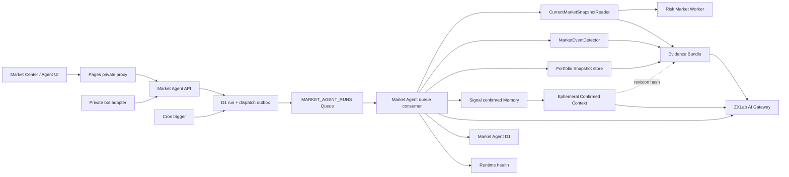
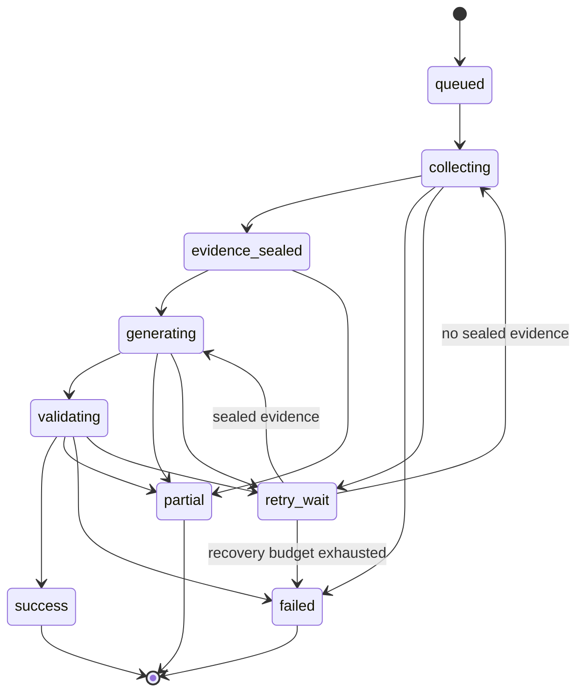

# ZXLab Personal Market Agent 总体建设方案

> 状态：Proposed<br>
> 面向版本：ZXLab beta 之后的增量建设<br>
> 首要用户：ZXLab 所有者本人<br>
> 核心约束：只读、证据驱动、可降级、可复盘、服务端 Secret、人工确认长期 Memory

## 1. 摘要

ZXLab Personal Market Agent（下文简称 Market Agent）不是一个附着在行情页上的通用聊天框，也不是自动交易系统。它是一个围绕个人自选、持仓风险和每日市场工作流构建的只读 Agent：先由确定性模块收集并冻结市场事实，再检测值得关注的事件，最后由模型在严格证据约束下生成解释、摘要和后续观察条件。

Market Agent 的目标闭环是：

```text
市场事实 -> 数据质量判断 -> 确定性事件 -> 持仓影响 -> 证据约束解释
        -> 用户反馈 -> 可审计运行记录 -> 人工确认的长期上下文
```

总体建设采用以下决策：

1. 新建独立的 `apps/market-agent-worker`，负责 Agent 编排、D1 状态、定时运行和受保护的私有接口。
2. `apps/risk-market-worker` 继续保持无状态的规范化市场数据层，不承担 Agent 状态或模型编排。
3. 在 `packages/market-schema` 建立 `MarketSnapshot` 契约，由 Risk Market Worker 负责当前事实采集和临时 Snapshot；Market Agent 只冻结、持久化与 Run 关联的 Snapshot，并据此生成 Event。
4. 先由 `MarketEventDetector` 产生确定性事件，再允许模型解释；模型不直接计算行情异常或风险指标。
5. 每次 Agent Run 使用冻结的 Evidence Bundle，结果必须引用其中的 Evidence ID，并保存 fingerprint。
6. 当前 Risk 本地账本继续作为账本事实来源。持仓感知的定时 Agent 只读取用户显式同步的、版本化 Portfolio Snapshot，不默认上传完整交易流水。
7. Canonical Memory 继续由 Signal 拥有。Agent 只能读取已确认上下文或提出 Candidate，不能自动激活长期 Memory。
8. 第一版不采用开放式 ReAct/tool loop，只实现固定工作流和有限读取工具，避免不可预测的成本、权限和错误传播。
9. 所有浏览器私有接口都通过 Cloudflare Access；Provider key、AI Gateway token、Memory bridge token 和内部服务 token 不进入浏览器。
10. 模型不可用时返回确定性降级结果；任何 LLM 失败都不能抹掉已经收集到的可靠事实。
11. Market Agent 使用独立的任务级 Gateway 身份和 retrieve-only/propose-only Memory 身份，不复用能够调用任意 task 或直接写 active Memory 的宽权限 token。
12. 浏览器只提交 workflow、问题、标的和确认操作；权威 Market Fact、Market Event 和 Evidence Bundle 必须由服务端重新收集、计算并冻结。
13. Run 采用 `202 + runId`、Cloudflare Queue、D1 lease/checkpoint、recovery outbox 和 DLQ reconciler；不在 HTTP 请求或 `waitUntil` 中完成整次 Agent。
14. 浏览器意图不含 `profileId`/`trigger`；Pages/Worker 通过 Access、server-side owner mapping 和短时效 actor envelope 保留最终用户身份与所有权边界。

## 2. 产品定位

### 2.1 North Star

Market Agent 应成为 ZXLab 的个人市场事实与复盘入口：

- Market 回答“发生了什么，数据是否可靠”。
- Risk 回答“这些事实对当前持仓意味着什么”。
- Signal 回答“哪些外部变化值得纳入每日注意力”。
- Market Agent 把上述材料组织成可执行的个人观察工作流，但不替用户做交易决策。

### 2.2 核心用户任务

Market Agent 需要稳定完成五类任务：

1. **盘前简报**：隔夜变化、当日事件、重要公告、数据可用性和需要关注的观察条件。
2. **盘后复盘**：自选与持仓表现、相对基准、成交异常、公告/新闻、风险变化和次日观察条件。
3. **单标的检查**：回答某个标的发生了什么、相对谁异常、证据是什么、哪些结论受数据质量限制。
4. **持仓影响**：在存在新鲜 Portfolio Snapshot 时，解释敞口、集中度、回撤和规则事件的变化。
5. **确定性提醒**：价格、成交、相对表现、公告和数据质量规则触发后，去重并投递简短通知。

### 2.3 明确非目标

第一阶段及可预见版本不建设：

- 自动下单、撤单、调仓或自动止损。
- 券商密码、交易 token 或交易权限托管。
- 模型生成确定性的买入、卖出、加仓或减仓指令。
- 高频行情存储、逐笔成交分析或低延迟交易设施。
- 多租户、团队权限和公共投资建议产品。
- 模型直接修改账本、风险规则、提醒规则或 active Memory。
- 模型自由调用任意 URL、任意 SQL、任意模型或任意工具。
- 在数据不可靠时生成看似精确的估值或风险数字。

## 3. 当前基础与建设前置条件

### 3.1 可直接复用的现有能力

| 现有模块 | 可复用能力 | Market Agent 使用方式 |
| --- | --- | --- |
| `apps/risk-market-worker` | 报价、日/分钟 K、新闻、公告、交易状态、provider fallback | 作为 Market Data Port 的生产 adapter |
| `functions/api/market/*` | 浏览器同源行情代理 | Market Center 保持现有读取路径；Agent 内部优先用 service binding |
| `src/features/risk` | 确定性账本回放、风险计算、Evidence Pack、数据质量降级 | 复用领域规则和 schema，不复制浏览器 UI 逻辑 |
| `functions/api/risk/review` | Access 校验、Evidence 验证、stream-first Gateway 调用、确定性 fallback | 复用安全与模型调用模式 |
| `apps/signal-worker` | Cron、D1 run/version 模式、候选确认、canonical Memory | 复用运行审计和 Memory 语义；不合并数据所有权 |
| `functions/_lib/ai` | 任务策略、模型路由、重试/fallback、SSE terminal contract、遥测 | 新增受限的 Market Agent task policy |
| `services/zxlab-bot-bridge` | Market/Risk/MCP 读取工具、Gateway client、证据引用校验 | 后续作为 Agent 的私有聊天 adapter，而不是第二套 Agent 实现 |
| `apps/runtime-worker` | 健康探测、粗粒度状态、incident | 增加 Market Agent 健康来源，但不公开个人运行内容 |

### 3.2 必须先修复的可信度问题

在 Agent 开始消费 Market Center 前，先完成以下基础修复：

1. 分钟数据只有 close 时，使用折线/面积图或回退到真正具备 OHLC 的 provider；不能一直显示“等待 K 线”。
2. 部分或全部 capability 失败时，页面和 Snapshot 必须进入 degraded/unavailable，不能继续显示绿色 Market API。
3. 接入可靠的中国交易日历；weekday approximation 只能作为明确标注的最后回退。
4. 修复切换标的时 in-flight 请求吞掉新请求的竞态。
5. 统一 `asOf`、`receivedAt`、`marketTimestamp`、freshness、session 和 capability health。
6. 将 status warnings、provider attempts 和 unavailable capability 纳入统一数据质量结果。

这些修复是 Agent MVP 的进入条件，而不是后续优化。

### 3.3 建设前需要收敛的共享契约

当前 Quote、Bar 和可靠性语义分别存在于 Market Center、Risk、Market Worker 和 bot bridge。Agent 建设前应收敛为两个共享包：

```text
packages/market-schema/
  browser-safe types
  runtime validators
  freshness and capability semantics
  schema version

packages/risk-domain/
  ledger-derived positions
  portfolio history replay
  deterministic risk calculation
  Evidence types and validators
```

Market Worker、Market Center、Risk、Market Agent 和 bot bridge 使用同一 `market-schema` 中的规范化类型、runtime validator、freshness 和 capability 语义，不再复制规范化结果的解释逻辑。腾讯、新浪、东财等 provider-specific parser、字段映射和 fallback 顺序必须继续只属于 Risk Market Worker，不能下沉到浏览器安全的共享包。浏览器 Risk 和 Agent Worker 使用同一 `risk-domain`，Worker 不从 `src/features/risk` 的 React/UI 路径导入领域计算。

现有 Signal、Risk 和 bot bridge 的 Gateway client 还存在重复。完成 Agent MVP 后，可将经过验证的 SSE terminal parser 收敛到 `packages/ai-gateway-client`；在此之前必须保持 terminal `done.data.json`、`reset` 和 transport-only fallback 语义一致。

### 3.4 Profile 与 Watchlist 启动 seam

当前 Market watchlist 存在浏览器 localStorage，scheduled Worker 无法读取。Phase 1 必须提供显式 bootstrap：

1. Pages 验证 Access 并传递签名 actor envelope；Market Agent Worker 依据 opaque owner subject 在 ProfileRepository 中解析或创建唯一 profile，不接受浏览器指定 profile ID。
2. Market Center 展示本地 watchlist 的标准化预览与 diff，用户确认后通过 `sync_watchlist` operation 写入版本化 server watchlist。
3. Scheduled workflow 只读取已确认的 server revision；本地 watchlist 后续变化不会静默上传。
4. 未完成 bootstrap 时，单标的手动检查仍可用；盘前/盘后全自选工作流返回 setup-required，不使用默认列表冒充用户配置。
5. Watch reason 属于 Market Agent D1 的结构化配置，不自动写入 canonical Memory。

## 4. 领域语言

完整词汇定义见 [`docs/market-agent/CONTEXT.md`](./market-agent/CONTEXT.md)，跨上下文关系见根目录 [`CONTEXT-MAP.md`](../CONTEXT-MAP.md)。方案和代码使用以下核心区分：

- **Market Fact** 是经过规范化、带来源和时间的外部事实。
- **Market Snapshot** 是同一观察时点的一组 Market Fact 和质量结论。
- **Market Event** 是确定性规则从一个或多个 Snapshot 中检测出的变化。
- **Observation** 是 Agent 对 Evidence Bundle 的输出，明确区分 fact、inference 和 unknown。
- **Agent Run** 是一次有状态、有审计记录的工作流执行。
- **Confirmed Context** 是用户已明确确认、可影响 Agent 解释偏好的长期上下文。
- **Portfolio Snapshot** 是从本地 Risk 账本派生并显式同步的只读版本，不等同于账本。
- **Alert Rule** 是用户确认过的确定性条件；模型可以起草，不能激活。

禁止用“信号”泛指 Market Event，以避免与 ZX Signal 子系统和交易信号混淆。

## 5. 总体架构



### 5.1 部署单元

新增 Worker：

```text
apps/market-agent-worker/
  migrations/
  src/
    agent/
    evidence/
    events/
    ports/
    repositories/
    routes/
    runs/
    schedules/
    security/
  test/
  package.json
  tsconfig.json
  wrangler.jsonc
```

`wrangler.jsonc` 为同一 Worker 配置 `MARKET_AGENT_RUNS` producer/main consumer、`MARKET_AGENT_RUNS_DLQ` recorder/reconciler consumer、D1、service binding 和 schedule。HTTP 与 Cron 只创建 Run 和 dispatch 记录；完整数据收集及模型生成不依赖请求生命周期或 `waitUntil`。

新增共享 schema：

```text
packages/market-agent-schema/
  src/
    commands.ts
    evidence.ts
    events.ts
    results.ts
    runs.ts
    index.ts
```

依赖的共享领域包：

```text
packages/market-schema/
packages/risk-domain/
packages/ai-gateway-client/  # 在至少两个生产调用方迁移后建立
```

Phase 1 创建 `apps/market-agent-worker`、`packages/market-agent-schema`、`packages/market-schema` 和 `packages/risk-domain` 时，必须同步把这些路径加入根 `package.json#workspaces` 并更新根 lockfile；否则本文的 `npm --workspace market-agent-worker` 验证命令不可执行。`packages/ai-gateway-client` 只在后续真正创建时再加入。

浏览器 UI：

```text
src/features/market-agent/
  client.ts
  types.ts
  AgentToday.tsx
  AgentAsk.tsx
  AgentRuns.tsx
  AgentRules.tsx
```

Pages 私有代理：

```text
functions/api/private/market-agent/[[path]].ts
functions/_lib/market-agent/proxy.ts
```

### 5.2 所有权

| 数据或行为 | 唯一所有者 | 说明 |
| --- | --- | --- |
| 市场 provider 与规范化 | Risk Market Worker | Agent 不直连第三方行情源 |
| `MarketSnapshot` 契约 | `packages/market-schema` | 页面、Risk、Agent 和 bot 共享 schema、freshness 与质量语义 |
| 当前 Market Fact 采集与临时 Snapshot | Risk Market Worker | 提供当前观察结果，不提供任意历史时点查询 |
| Run 冻结 Snapshot 与 Market Event | Market Agent Worker | 只拥有与 Run 绑定的不可变副本和确定性变化 |
| 本地交易账本 | Risk 浏览器工作台 | 第一阶段不迁移完整账本 |
| 同步 Portfolio Snapshot | Market Agent Worker | 只读、版本化、可过期 |
| Risk 计算规则 | Risk 领域模块 | Agent 只消费结果和 Evidence |
| Agent Run、规则状态、反馈 | Market Agent D1 | 不写入 Signal D1 |
| Canonical Memory | Signal Worker | Agent 只读 active Memory 或提交 Candidate |
| 模型选择、fallback、usage | AI Gateway | Agent 不能指定 provider 和模型 |
| 粗粒度运行健康 | Runtime Worker | 不公开个人关注内容和模型正文 |

## 6. 深模块与接口

### 6.1 MarketAgent

外部 seam 只负责排队和读取状态，不在 HTTP 请求中同步完成长耗时生成：

```ts
export interface MarketAgentService {
  enqueue(intent: BrowserRunIntent, actor: ResolvedActorContext, request: ManualEnqueueRequest): Promise<QueuedAgentRun>;
  getRun(runId: string, actor: ResolvedActorContext): Promise<AgentRun | null>;
}

export type BrowserRunIntent =
  | { type: "morning_brief"; marketDate: string }
  | { type: "close_review"; marketDate: string }
  | { type: "inspect_instrument"; instrumentId: string; question?: string }
  | { type: "portfolio_impact"; marketDate: string; question?: string };

export interface ManualEnqueueRequest {
  idempotencyKey: string;
  revisionOfRunId?: string;
}

export interface ResolvedActorContext {
  kind: "access_user" | "bot_service" | "scheduler";
  actorId: string; // stable opaque ID; never raw email/token
  profileId: string;
  scopes: string[];
  requestId: string;
}

export interface TrustedActorEnvelope extends ResolvedActorContext {
  issuedAt: string;
  expiresAt: string;
  signature: string;
}

interface TrustedRunEnqueuer {
  enqueue(command: MarketAgentCommand, actor: TrustedActorEnvelope, request: RunEnqueueRequest): Promise<QueuedAgentRun>;
}

export interface RunEnqueueRequest {
  trigger: "manual" | "scheduled" | "bot";
  idempotencyKey: string;
  revisionOfRunId?: string;
}

export interface QueuedAgentRun {
  runId: string;
  status: "queued";
  created: boolean;
}

export type MarketAgentCommand =
  | { type: "morning_brief"; profileId: string; marketDate: string }
  | { type: "close_review"; profileId: string; marketDate: string }
  | { type: "inspect_instrument"; profileId: string; instrumentId: string; question?: string }
  | { type: "portfolio_impact"; profileId: string; marketDate: string; question?: string };
```

`BrowserRunIntent` 永远不含 `profileId` 或 `trigger`。Pages 验证 Access 后，从 server-side owner mapping 解析 subject/profile/scopes，生成短时效、带 request ID 的签名 actor envelope；Market Agent Worker 使用独立的 proxy identity 验签后才转换为 `ResolvedActorContext`。不能信任公共请求自带的 identity/profile header。Bot 使用绑定到 owner profile 的独立 service actor，scheduler 使用只具 enqueue scope 的 schedule actor；三者的 kind 和审计身份不混用。

Run 查询、反馈、rerun 和 `revisionOfRunId` 都必须验证 actor 对 profile 和目标 Run 的所有权。内部 `MarketAgentCommand` 才包含服务端解析出的 `profileId`；`TrustedRunEnqueuer` 不向浏览器暴露。

配置写入使用独立的小接口，不混入模型执行：

```ts
export interface MarketAgentControl {
  propose(command: ConfigProposalCommand, actor: ResolvedActorContext): Promise<OperationProposal>;
  confirm(input: OperationConfirmation, actor: ResolvedActorContext): Promise<ConfirmedOperation>;
}

export type ConfigProposalCommand =
  | { type: "sync_watchlist"; revision: string; items: WatchlistItemInput[] }
  | { type: "sync_portfolio_snapshot"; snapshot: PortfolioSnapshotUpload }
  | { type: "stop_portfolio_use"; snapshotId: string }
  | { type: "purge_portfolio_history"; scope: "all" | "expired" }
  | { type: "purge_context_history"; memoryId: string }
  | { type: "purge_run"; runId: string }
  | { type: "purge_expired_runs"; before: string }
  | { type: "update_profile"; patch: MarketAgentProfilePatch }
  | { type: "upsert_alert_rule"; rule: AlertRuleDraftInput }
  | { type: "retire_alert_rule"; ruleId: string; expectedRuleVersion: number }
  | { type: "update_delivery_settings"; settings: DeliverySettingsInput }
  | { type: "replay_dead_letter"; deadLetterRecordId: string };

export interface OperationConfirmation {
  operationId: string;
  expectedVersion: number;
  confirmationToken: string;
}
```

自然语言中的“确认”不构成授权。`propose` 只接受上面的封闭 discriminated union，规范化并保存完整 payload、actor、profile、diff 和 payload hash。`confirm` 只接受 `operationId + expectedVersion + confirmationToken`，不得携带或覆盖业务字段；执行内容必须来自服务端已保存、未过期、hash 匹配的 Proposal，并用 compare-and-swap 保证并发确认只生效一次。Run enqueue 和 feedback 使用各自独立的严格 schema、大小限制与所有权校验，不进入通用 Proposal。

接口不暴露 provider、模型、工具选择、重试、缓存、D1 transaction 或 prompt。调用方只需理解 command、认证、排队语义、幂等行为和 terminal result。

接口不变量：

- 每个成功或 partial Run 必须关联一个 sealed Evidence Bundle。
- 每个 Observation 的 Evidence ID 必须存在于该 Bundle。
- 浏览器不得提供 Market Fact、`reliable`、Market Event 或已组装的 Evidence Bundle；这些字段只能由 Worker 创建。
- scheduled key 固定由 `profileId + workflow + marketDate + scheduleSlot + schemaVersion + eventRuleVersion` 生成；相同 key 不得生成两份有效 Run。
- 手动请求必须提供显式 `Idempotency-Key`；用户主动“重跑”必须使用新 key，并写入 `revisionOfRunId`，不能被旧 Run 吞掉。
- 同一 actor/key 只有在 canonical command hash 一致时返回既有 Run；key 相同但 payload 不同必须返回 `409 IDEMPOTENCY_KEY_REUSED`。
- Run 一旦 terminal 就不可原地改写；重跑创建新 revision/run。
- 模型输出永远不能直接触发写操作。
- 缺少可靠数据时，允许 partial/failed，不允许伪造完整答案。

### 6.2 Current Market Snapshot

```ts
export interface CurrentMarketSnapshotReader {
  getCurrentSnapshot(input: {
    instrumentIds: string[];
    selectedInstrumentId?: string;
    intervals: Array<"1m" | "1d">;
    include: Array<"quotes" | "bars" | "news" | "announcements" | "comparisons">;
    quoteMode: "fallback" | "corroborated";
  }): Promise<MarketSnapshot>;
}
```

该模块隐藏：

- 多 capability 并发。
- provider fallback 和超时。
- 交易时段与节假日判断。
- source/receive/market 时间归一化。
- 缓存和 stale 阈值。
- 部分失败合并。
- 相对基准计算所需的数据获取。

`MarketSnapshot` 契约属于 `packages/market-schema`。当前 Risk Market Worker 只有分散的 quote、bars、news、announcements 和 status 路由；Phase 0 必须在同一 Worker 新增聚合读取 seam：

```text
GET /api/market/snapshot?ids=...&include=...&intervals=...&quoteMode=fallback|corroborated
```

该 route 在 Worker 内调用既有 capability 函数并统一合并质量，不通过 HTTP 递归调用自己的分散路由。生产 `CurrentMarketSnapshotReader` 通过 service binding 调用该 route；测试 adapter 使用固定 fixture。结果中的 `asOf` 是服务端实际观察时间，不是调用方指定的查询时间。该 seam 不支持任意 point-in-time 查询；历史比较只能读取 Market Agent 已持久化的 Run Snapshot 或 Market Worker 明确提供的历史 bars。

聚合 route 交付后，页面、Risk 和 bot 分阶段迁移到 Market Worker 的规范化当前 Snapshot，不依赖私有 Market Agent；Agent 只在 Run 内保存不可变副本，避免各调用方重新解释 provider response。

`fallback` 保持现有首个有效 provider 成功即返回的语义，不能声称做过跨源一致性检查。`corroborated` 明确请求至少两个独立报价源；只有这个模式可以在差异超过规则阈值时产生 `conflicted`。包含价格结论的 Market Agent 工作流对其受限标的集合预先使用 `corroborated`，页面普通浏览可使用 `fallback`；第二来源不可用时标为 limitation，不能伪装成已交叉验证。

Phase 0 同时定义交易日历 seam：

```ts
export interface TradingCalendar {
  getMarketDay(market: "CN", date: string): Promise<{
    status: "trading_day" | "holiday" | "unknown";
    source: string;
    reliable: boolean;
    warnings: string[];
  }>;
}
```

生产 adapter 必须覆盖法定休市和临时休市并可缓存、可 fixture 测试；weekday approximation 只能返回 `reliable: false` 的明确 fallback，不能伪装成正式日历。

### 6.3 MarketEventDetector

```ts
export interface MarketEventDetector {
  detect(input: {
    current: MarketSnapshot;
    previous?: MarketSnapshot;
    rules: EventDetectionRules;
  }): MarketEvent[];
}
```

第一版只包含可解释的确定性规则：

- 绝对涨跌幅。
- 相对基准超额表现。
- 成交额/成交量分位或同期异常。
- 波动率和日内区间异常。
- 新公告。
- 新闻密度变化。
- quote stale、provider exhaustion、calendar fallback 等数据质量事件。

每个 Event 必须包含 rule ID、actual value、threshold、观察时间、source Evidence ID 和 reliability。

### 6.4 EvidenceAssembler

```ts
export interface EvidenceAssembler {
  assemble(input: {
    command: MarketAgentCommand;
    market: MarketSnapshot;
    events: MarketEvent[];
    portfolio?: PortfolioSnapshot;
    risk?: RiskImpact;
    confirmedContext: ConfirmedContext[];
    previousRun?: AgentRunSummary;
  }): Promise<PreparedEvidence>;
}

export interface PreparedEvidence {
  sealed: SealedEvidenceBundle;
  ephemeralConfirmedContext: ConfirmedContext[];
}
```

fingerprint 使用 canonical JSON 计算：

- 包含 Market Fact 的真实 market timestamp、值、source 和 quality。
- 包含 Portfolio Snapshot revision、Risk 规则版本和 Event rule 版本。
- 包含 profile/watchlist revision 和实际 instrument scope。
- 包含使用过的 canonical Memory ID、role 和 revision/content hash，不包含可检索的 Memory 正文副本。
- 标记每类证据的 origin；市场事实必须是 `server-observed`，同步持仓必须是 `user-supplied-risk-snapshot`。
- 排除 request ID、provider latency、日志时间和其他非语义运行字段。
- Bundle sealed 后不可继续追加证据；补充数据必须产生新 Bundle。

### 6.5 AgentNarrator

模型 seam 的接口：

```ts
export interface AgentNarrator {
  narrate(input: {
    workflow: "morning_brief" | "close_review" | "instrument_answer" | "portfolio_impact";
    evidence: SealedEvidenceBundle;
    ephemeralConfirmedContext: ConfirmedContext[];
  }): Promise<AgentNarration>;
}
```

生产 adapter 调用 AI Gateway；测试 adapter 返回确定性 fixture。调用前逐条验证 `ephemeralConfirmedContext` 的 canonical hash 与 `ContextUseRecord.revisionHash` 一致。正文只存在于本次内存和 Gateway request，不写 D1、日志或遥测，调用完成后丢弃。Context 只影响排序、关注重点和展示约束；持久化结果不得逐字或近似复述 Memory 正文，belief 也不能创建 fact/inference。输出经过本地 schema、Evidence ID、禁用交易指令、字段长度、枚举和 context-leak 校验。一次 Run 最多进行一次完整 repair；repair 仍失败则使用确定性 fallback。

### 6.6 RunRepository

D1 和 in-memory adapter 共享以下接口：

```ts
export interface RunRepository {
  createQueued(command: MarketAgentCommand, request: RunCreation): Promise<{ run: AgentRun; created: boolean }>;
  claim(runId: string, workerId: string, now: string, leaseExpiresAt: string): Promise<RunClaimResult>;
  renewLease(runId: string, leaseToken: string, leaseExpiresAt: string): Promise<boolean>;
  sealEvidence(runId: string, leaseToken: string, evidence: SealedEvidenceBundle): Promise<void>;
  releaseForRetry(runId: string, leaseToken: string, failure: SafeRunFailure): Promise<void>;
  complete(runId: string, leaseToken: string, result: AgentResult, diagnostics: RunDiagnostics): Promise<void>;
  fail(runId: string, leaseToken: string, failure: SafeRunFailure): Promise<void>;
  recordDeadLetter(runId: string, record: DeadLetterRecord): Promise<DeadLetterDisposition>;
  reconcileExpiredRun(runId: string, now: string): Promise<RecoveryDisposition>;
  get(runId: string): Promise<AgentRun | null>;
  findByIdempotencyKey(key: string): Promise<AgentRun | null>;
}

export interface RunCreation extends RunEnqueueRequest {
  actorScope: string;
  commandHash: `sha256:${string}`;
}

export interface RunLease {
  run: AgentRun;
  leaseToken: string;
  attempt: number;
  leaseExpiresAt: string;
}

export type RunClaimResult =
  | { kind: "claimed"; lease: RunLease }
  | { kind: "terminal" }
  | { kind: "leased"; retryAfter: string }
  | { kind: "missing" };

export type DeadLetterDisposition =
  | "deferred_active_lease"
  | "resolved_terminal"
  | "orphaned"
  | "ready_for_reconcile";

export type RecoveryDisposition =
  | "lease_still_active"
  | "recovery_enqueued"
  | "finalized_failed"
  | "resolved_terminal";
```

`claim`、续租和 terminal 写入都使用 compare-and-swap；旧 lease 的消费者不能覆盖已被其他消费者接管的 Run。测试只从此接口观察状态，不依赖内部 SQL 或中间对象。

### 6.7 Run Dispatch 与恢复

`MARKET_AGENT_RUNS` Queue 是完整 Run 的执行边界：

1. `POST /runs` 在 D1 transaction 中创建 `queued` Run 和 `run_dispatch_outbox`，随后尝试发送 `{ runId }`，立即返回 `202 { runId, status: "queued" }`。
2. Scheduled handler 使用同一创建路径和 scheduled idempotency key，不直接执行工作流。
3. 如果 D1 commit 后 Queue send 失败，dispatch 记录保持 pending；独立于业务 schedule 开关的 maintenance dispatcher 扫描并重发。Queue 重复投递由 Run claim 去重。
4. Consumer 以条件更新领取 D1 lease，写入 `leaseOwner`、`leaseExpiresAt` 和递增的 D1 `attempt`；长阶段在安全点续租。D1 attempt 表示实际领取执行次数，不能与 Queue message delivery attempts 混为一个计数。
5. 主 Queue 对每条消息显式处理：`terminal` 才 ack；`leased` 延迟 retry 到 lease 到期附近；`missing` retry 并最终进入 DLQ；`claimed` 才执行。未过期 lease 绝不能 ack，否则原 consumer 崩溃后将没有消息接管。
6. `claimed` 执行成功/partial 时先完成 terminal transaction 再 ack；明确不可重试的领域错误先 `fail` 再 ack；可重试错误先持久化 `retry_wait`、释放 lease，再调用 message retry/backoff，不能提前写 terminal failed。
7. Cloudflare 达到配置的 `max_retries` 后把该条消息路由到 `MARKET_AGENT_RUNS_DLQ`。DLQ consumer 先幂等写 `dead_letter_records`，再按 Run 状态处理：terminal 只关闭记录；不存在 Run 标记 orphaned 并告警；存在未过期 lease 时标记 `deferred_active_lease` 后 ack，绝不能提前把健康执行置为 failed。
8. 独立于业务 schedule 的 expired-nonterminal lease sweeper 扫描 deferred dead letter 和过期 lease：Run 已 terminal 时关闭记录；仍 nonterminal 且 lease 已过期时，若 application recovery budget 尚有余额，则在 dispatch/recovery outbox 写一个稳定 generation 的恢复消息；预算耗尽才原子转为 failed。若 lease 被续租则按新的 expiry 延后。DLQ consumer 与 sweeper 都不直接执行工作流。
9. `dead_letter_records` 状态至少包含 `deferred_active_lease | recovery_enqueued | finalized_failed | resolved_terminal | orphaned`，并产生 Runtime 告警。受 Access 保护的人工 replay 只针对 `finalized_failed` 且仍可读取原 command 的记录，创建新 idempotency key 和 `revisionOfRunId`，不复活或改写旧 Run。
10. 浏览器通过 `GET /runs/:id` 轮询，后续可在不改变领域接口的前提下增加 SSE 状态通知。

此设计把 D1 与 Queue 的非原子双写限制在可修复的 dispatch outbox 内；不把完整 Agent 执行寄托在 HTTP request 或 fire-and-forget `waitUntil` 上。

Consumer 持久化阶段 checkpoint：未 seal 的采集阶段可以在接管后重新执行；一旦 Evidence 已 seal，后续 retry 必须复用同一 Bundle，不能重新抓取事实。Gateway 调用可能因崩溃产生额外 attempt，但 terminal compare-and-swap 和 delivery outbox 保证不会生成两个有效结果或重复投递。每阶段 timeout 与总执行预算必须低于 Queue consumer 的平台上限；若未来工作流无法满足，应把长编排迁移到 Cloudflare Workflows，而不是延长 HTTP 请求。

平台实现基线在 2026-08-03 依据 Cloudflare 官方的 [Queue producer/consumer 配置](https://developers.cloudflare.com/queues/configuration/configure-queues/)、[重试](https://developers.cloudflare.com/queues/configuration/batching-retries/)、[Dead Letter Queue](https://developers.cloudflare.com/queues/configuration/dead-letter-queues/) 和 [Workers duration / `waitUntil` 限制](https://developers.cloudflare.com/workers/platform/limits/) 核对；实现阶段仍需按当时文档复查。

## 7. 工作流设计

### 7.1 Run 状态机



状态要求：

- `collecting` 只执行确定性读取与计算。
- `evidence_sealed` 之后，模型只能读取 Bundle。
- `partial` 必须保留可用事实、明确失败 capability 和 limitation。
- `failed` 仍需保留安全错误码、阶段和重试资格，不能记录 secret 或上游原文。
- `retry_wait` 是 nonterminal Queue 状态，必须释放 lease 并保留最后一个安全失败摘要。
- terminal Run 不更新正文；用户反馈和投递状态存为关联记录。
- nonterminal Run 可在 lease 过期后由新 consumer 接管；`evidence_sealed` 之后只能从已保存 checkpoint 继续，不能重新采集后偷偷改变 Evidence。

### 7.2 盘后复盘

第一版主工作流：

1. 校验 trading calendar，确认 marketDate 是交易日且已收盘。
2. 加载 profile、自选、基准和已确认规则。
3. 获取 Market Snapshot，并与上一交易日 Snapshot 比较。
4. 运行 MarketEventDetector。
5. 如存在新鲜 Portfolio Snapshot，计算 Risk Impact；否则进入 market-only 模式并标注 limitation。
6. 从 Signal 读取与本次标的相关的 Confirmed Context。
7. 组装并 seal Evidence Bundle。
8. 先生成确定性摘要骨架，再调用 AgentNarrator。
9. 校验 schema、引用和交易指令禁令。
10. 原子完成 Run，生成页面内投递记录。

输出优先回答：

- 今日最重要的三件事。
- 哪些标的相对基准异常。
- 哪些变化与公告或消息面时间上相关。
- 对持仓风险产生了哪些确定性影响。
- 明日需要观察哪些条件。
- 哪些结论受到数据质量限制。

### 7.3 盘前简报

盘前工作流只读取上一交易日收盘、隔夜新闻/公告和当日交易状态。没有盘前可靠行情时不得描述“当前价格”。输出重点是待观察条件，不做开盘预测。宏观或公司事件日历属于后续可选 capability，在存在独立、可靠数据源和 schema 前不进入 MVP。

### 7.4 单标的问答

第一版不允许模型自由规划工具。路由层将问题归一到固定 scope：

- `today_change`
- `relative_performance`
- `news_and_announcements`
- `data_quality`
- `portfolio_impact`
- `compare_previous_run`

每个 scope 对应预定义的数据收集计划，最多一次模型生成。无法安全归类的问题返回 clarification，不进入开放式工具循环。

### 7.5 Alert 工作流

Alert 由确定性引擎评估：

```text
inactive -> triggered -> acknowledged -> recovered
          -> suppressed
```

模型只能：

- 将自然语言意图转换为 Alert Rule Draft。
- 在规则触发后将结构化事实压缩为短文案。

用户必须确认 Draft 才能激活。引擎负责去重、冷却、静默时段、每日上限、恢复通知和数据可靠性门槛。

## 8. 数据契约

### 8.1 Market Snapshot

```ts
export interface MarketSnapshot {
  id: string;
  asOf: string;
  marketDate: string;
  session: "preopen" | "open" | "break" | "closed" | "holiday" | "unknown";
  reliable: boolean;
  instruments: InstrumentSnapshot[];
  capabilityHealth: CapabilityHealth[];
  providerAttempts: ProviderAttempt[];
  warnings: string[];
}

export type MarketFactQuality =
  | "live"
  | "cached"
  | "stale"
  | "conflicted"
  | "unavailable";
```

每个规范化 Market Fact 及相关 `CapabilityHealth` 使用上述 quality；Snapshot 的 `reliable` 是工作流所需事实的聚合结论，不是“请求成功”的同义词。它必须同时考虑交易时段、market timestamp、stale 阈值、provider schema、日历可靠性和所需 capability 是否完整。`conflicted` 只允许来自显式 corroboration，不允许从顺序 fallback 推断。

### 8.2 Evidence Bundle

```ts
export interface SealedEvidenceBundle {
  id: string;
  schemaVersion: "market-agent-evidence.v1";
  fingerprint: `sha256:${string}`;
  generatedAt: string;
  command: BrowserRunIntent; // sanitized scope, never profile/actor identity
  marketSnapshotId: string;
  portfolioSnapshotId: string | null;
  riskRuleVersion: string | null;
  eventRuleVersion: string;
  reliable: boolean;
  evidence: EvidenceItem[];
  events: MarketEvent[];
  contextUses: ContextUseRecord[];
  warnings: string[];
  limitations: string[];
}

export interface ContextUseRecord {
  evidenceId: string;
  memoryId: string;
  revisionHash: `sha256:${string}`;
  role: "preference" | "watch_reason" | "belief" | "constraint";
  usedAt: string;
}
```

外部新闻和公告正文始终作为 untrusted data 放在结构化字段中，不拼接为 system instruction。`EvidenceItem[]` 不得另行保存 Memory 正文。`contextUses` 不是 Memory 副本：它不含正文，不能被任何未来 Run 当作 Memory 检索源；revision hash 只用于证明本次使用了哪个 canonical 版本。

### 8.3 Agent Result

```ts
export interface AgentResult {
  status: "success" | "partial";
  headline: string;
  summary: string;
  observations: Array<{
    id: string;
    kind: "fact" | "inference" | "unknown";
    importance: "high" | "medium" | "low";
    title: string;
    explanation: string;
    evidenceIds: string[];
  }>;
  portfolioImpacts: Array<{
    id: string;
    title: string;
    explanation: string;
    evidenceIds: string[];
  }>;
  watchNext: Array<{
    condition: string;
    reason: string;
    evidenceIds: string[];
  }>;
  limitations: string[];
}
```

`failed` 是 Agent Run 状态，不是可展示的 `AgentResult`。Failed Run 不保存模型或模板正文，只通过 `SafeRunFailure` 保存安全错误码、失败阶段、retryable 和诊断引用；这与 `RunRepository.complete(...)` / `fail(...)` 的分离保持一致。

验证规则：

- `fact` 和 portfolio impact 必须拥有非空 Evidence ID。
- `inference` 必须引用支持它的事实，并使用不确定性措辞。
- `ContextUseRecord` 不能单独支持 fact、inference 或 portfolio impact，只能解释排序/展示偏好是否被应用。
- `unknown` 用于明确缺失材料，不能被隐藏。
- 所有引用必须属于当前 Bundle。
- 结果不得出现执行型交易指令。
- Bundle 不可靠时，结果不能标记为完整可靠。

## 9. Portfolio Snapshot 同步

### 9.1 原因

当前生产 Risk 工作台的账本主要存于浏览器。Cloudflare Worker 的 scheduled handler 无法读取浏览器 localStorage，因此“定时、持仓感知 Agent”必须显式解决这个 seam。

### 9.2 推荐方案

Risk 工作台继续从本地账本确定性派生 Portfolio Snapshot，用户通过 Access 保护的操作显式同步：

```ts
export interface PortfolioSnapshot {
  id: string;
  schemaVersion: "portfolio-snapshot.v1";
  sourceRevision: string;
  calculatedAt: string;
  effectiveAt: string;
  expiresAt: string;
  positions: ReadonlyPosition[];
  cash: number;
  historySummary?: PortfolioHistorySummary;
  rulesVersion: string;
  reliable: boolean;
  warnings: string[];
  fingerprint: `sha256:${string}`;
}

export type PortfolioSnapshotUpload = Omit<
  PortfolioSnapshot,
  "id" | "reliable" | "warnings" | "fingerprint"
> & {
  clientFingerprint?: `sha256:${string}`;
};
```

Portfolio Snapshot 属于用户提供的私人状态，不应冒充服务端独立验证的券商事实。Worker 必须校验 schema、字段范围、版本、数量上限和过期时间，再对规范化后的 server representation 计算新的权威 `fingerprint`、`reliable` 与 `warnings`。可选 `clientFingerprint` 只用于传输完整性或诊断比对，不能作为服务端 fingerprint 或可靠性依据。所有价格、交易状态和市场质量仍由服务端重新获取；Snapshot 的 `reliable` 只表示内部字段完整和版本有效，不表示券商已经对账。

默认不上传：

- 原始券商文件。
- 完整逐笔交易流水。
- 券商凭证。
- 用户自由文本备注。
- 不参与 Risk 计算的个人信息。

同步 UI 必须显示字段预览、版本、过期时间和两种不同的数据控制。Agent 使用过期 Snapshot 时只能进入 market-only 或 partial 模式。

### 9.3 停止使用与隐私清除

- `stop_portfolio_use` 立即取消 current Snapshot，未来 Run 不再读取；已经 sealed 的历史 Run 仍保留当时的最小 Portfolio Snapshot 和派生 Risk Evidence，直到 Run 保留期结束。
- `purge_portfolio_history` 是隐私级级联清除：删除相关 Portfolio Snapshot、Evidence、Observation 和可展示 Run 正文，只留下不含仓位/正文的 tombstone 与 audit hash。
- 历史 Portfolio Snapshot 只属于原 Run，绝不能因为仍在保留期内而被后续 Run 重新选为“当前持仓”。
- UI 必须清楚显示两种操作的范围、受影响 Run 数量和不可恢复性，并走 proposal/confirm。

### 9.4 后续演进

如果未来需要服务端账本，应作为 Risk 的独立、显式迁移项目处理，不在 Market Agent 建设中顺带完成。

## 10. Memory 设计

Market Agent 不创建第二个 canonical Memory。Run 只保存有期限、不可反向检索的 `ContextUseRecord`；Memory 正文仅在当前执行中短暂使用。

### 10.1 可读取内容与现有 Signal 映射

`preference`、`watch_reason`、`belief` 和 `constraint` 是 Market Agent 的领域角色，不是新的 Signal storage kind。MVP 保持 Signal 现有 `preference | fact | decision | summary` union 不变：

| Market Agent 领域角色 | Signal kind | `sourceType` | 规则 |
| --- | --- | --- | --- |
| `preference` | `preference` | `market-agent-preference` | 摘要长度、关注指标和解释偏好 |
| `watch_reason` | `summary` | `market-agent-watch-reason` | 为什么关注某标的，不提升为市场事实 |
| `belief` | `summary` | `market-agent-belief` | 始终渲染为“用户观点”，不能进入事实区 |
| `constraint` | `decision` | `market-agent-presentation-constraint` | 仅用于叙事或展示约束 |

结构化 watchlist、Alert Rule、静默时段和通知限额继续存 Market Agent D1，不写入 Memory。MVP 不增加新的 Memory kind；若未来需要一等 `belief` 类型，必须单独修改 Signal schema、migration、repository、管理 UI 和回滚策略。

`ConfirmedContext` 是 Signal 对 canonical Memory 的只读投影，不是新的数据库 status。MVP 投影规则为：

- `memory_items.status = active` 且未过期；`superseded` 和 `forgotten` 永不返回。
- namespace 仅允许当前请求声明的 `markets` 和必要的 `global`，再执行 scope、相关性、条数与 token budget 限制。
- `confirmed` 在此表示“当前 canonical active item”，不假设数据库存在 `confirmed` 字段。
- Market Agent 领域角色由 kind 与 allowlisted `sourceType` 映射；无法识别的 legacy summary/decision 默认不注入，需用户在 Signal 管理界面重新分类。
- `fact` kind 即使 active 也只能作为个人上下文显示，不能投影成 Market Fact。

### 10.2 禁止行为

- 将市场价格、新闻、公告保存为长期 Memory。
- 将模型 Observation 自动转为 active Memory。
- 将 belief 注入事实区。
- 将一次性问答自动升级为长期偏好。

### 10.3 Candidate 流程

```text
Agent 识别潜在长期上下文
-> 生成 Memory Candidate
-> 用户查看 scope、内容和来源
-> 接受 / 编辑后接受 / 拒绝
-> Signal 写入 canonical memory_items 和 revision
```

Market Agent 使用两个最小权限 seam：

- `retrieve_confirmed_context`：只能读取符合上述 canonical active 投影和 namespace/scope 的内容。
- `propose_memory_candidate`：只能创建 Candidate，不能创建、更新、接受或忘记 canonical item。

`propose_memory_candidate` 不是当前可直接复用的既有 contract。在启用 Candidate 流程前，必须在 Signal 新增 candidate-only internal handler 和 repository method，只允许写 pending candidate，并记录 caller、scope、source Run 与审计信息。现有 Candidate schema 还不能保留 Market Agent 的 `sourceType`；需增加 allowlisted `proposed_source_type` 与 `source_run_id`，并在用户接受时复制到 canonical item，才能落实上表映射。Service binding 只解决路由，不等同于授权；handler 仍需校验专用的 caller identity 或 scoped server token。

Candidate 审计必须分别记录 `proposedByService`、`sourceRunId`、opaque `confirmedByAccessSubjectHash` 和 `confirmedAt`。Bot 与 Market Agent 只能填前两项；只有 Signal 管理界面中经过 Access 验证的用户接受操作才能填后两项并创建 active item。自然语言“确认”或 Bot 再调用一次工具都不能充当接受凭证。

不得把现有同时拥有 retrieve 和直接写 item 能力的宽权限 Memory bridge token 配置给 Agent。

### 10.4 历史使用与清除语义

- Signal 的 `forget` 立即停止未来 retrieve，但不会把历史 Run 变成新的 Memory 来源。
- 普通 forget 后，历史 Run 只保留 `memoryId + revisionHash + role + usedAt`，直到 Run 保留期结束；不保留 Memory 正文副本。
- “隐私级彻底清除 Agent 历史”是独立、显式确认的 `purge_context_history` operation：按 memory ID 级联删除相关 Evidence、Observation 和可展示 Run 正文，只留下不含内容的 tombstone/audit hash。
- UI 必须分别说明“停止未来使用”和“同时清除历史 Run”的影响，不能用一个含糊的“删除”按钮代替。

## 11. D1 数据模型

建议表：

| 表 | 用途 | 保留策略 |
| --- | --- | --- |
| `market_agent_profiles` | 单用户配置、默认基准、时区、briefing 开关 | active + revision |
| `market_watchlists` / `market_watchlist_items` | 服务端自选和关注理由引用 | 软删除 + revision |
| `run_market_snapshots` | 与 Run 绑定的冻结 Snapshot 摘要和 fingerprint | 随完整 Run 默认 365 天 |
| `portfolio_snapshots` | 用户显式同步的只读持仓版本 | current 可停止使用；历史随 Run 保留或隐私级 purge |
| `market_events` | 确定性事件、dedupe key、reliability | 默认 365 天 |
| `schedule_decisions` | 每个 schedule slot 的 calendar 结果与 enqueued/skipped/blocked 决策 | 默认 90 天 |
| `agent_runs` | workflow、trigger、幂等键、revision、lease、attempt/recovery generation、状态和安全错误 | 完整内容默认 365 天；之后仅 tombstone |
| `run_dispatch_outbox` | D1 commit 后待发送的 initial/recovery Queue 消息与稳定 generation | terminal 后 30 天 |
| `dead_letter_records` | DLQ message ID、Run、deferred/final 状态、最后安全错误和 replay 关系 | 默认 365 天，不保存业务正文 |
| `agent_evidence_bundles` | 冻结证据与 fingerprint | 随完整 Run 默认 365 天 |
| `agent_observations` | 结构化结果 | 与支撑 Evidence 同期保留 |
| `agent_feedback` | helpful、fact error、missing factor、备注 | 默认 365 天 |
| `alert_rule_drafts` | 待确认规则 | 30 天过期 |
| `alert_rules` / `alert_state` | active rule 和状态机 | 软删除 + revision |
| `delivery_outbox` | 投递、重试、幂等状态 | terminal 后 90 天 |
| `operation_proposals` | 高风险配置变更草案、版本和过期时间 | pending payload 短时保存；terminal 后只留 hash/metadata 90 天 |
| `audit_log` | 确认、删除、同步和投递设置的前后 hash | 默认 365 天 |

约束：

- scheduled run 的 key 由 `profileId + workflow + marketDate + scheduleSlot + schemaVersion + eventRuleVersion` 生成并唯一。
- manual/bot key 在 actor scope 内唯一；显式 rerun 使用新 key 和 `revision_of_run_id`。
- Queue message 只携带 `runId`，不携带持仓、Memory、Evidence 或问题正文。
- lease owner/token/expiry 和 attempt 的更新使用 compare-and-swap；terminal Run 拒绝旧 lease 写入。
- `dead_letter_records` 的唯一 message ID 防止 DLQ 重投重复 finalization；replay 只关联新 Run。
- Recovery outbox 以 `runId + recoveryGeneration` 唯一；sweeper 对未过期 lease 只能 defer，不能 finalize。
- Evidence fingerprint 和 schema version 必填。
- Persisted Bundle 只保存 `ContextUseRecord`，不保存 Confirmed Context 正文；普通历史记录不得参与未来 Memory retrieval。
- alert occurrence 使用稳定 dedupe key。
- D1 transaction 原子提交 terminal Run、Observation 和 outbox。
- 高风险写入在同一 transaction 中完成 proposal 状态、领域对象 revision 和 audit log。
- Proposal 的完整 normalized payload 只保留到短时 confirmation expiry；confirmed/rejected/expired 后立即清除 Portfolio/Watchlist 等敏感 payload，90 天审计只保留 type、diff 摘要和 hash。
- 不在诊断表中保存完整 prompt、Secret、Access JWT、外部 header 或未经规范化的上游正文。

保留期清理必须以 Run 为单位：可展示的 Observation、sealed Evidence、冻结 Snapshot 和必要 Event 同期删除。到期后 `agent_runs` 只保留 workflow、时间、状态、版本、fingerprint 与“证据已过期”tombstone，不再展示无法追溯的结论正文。若用户把完整保留期改为 90 天，结果正文也必须同步缩短到 90 天。

“sealed/immutable”禁止原地修改，不禁止经过用户明确确认的隐私删除。`purge_portfolio_history` 和 `purge_context_history` 必须按引用关系级联清理，不能留下孤立、仍可读的 Evidence 或 Observation。

提供 Access 保护的结构化导出、按数据类型清理和最终硬删除。清理/硬删除先展示影响范围并走 operation proposal/confirm；审计仅保留不含正文的 actor、时间、类型和前后 hash，不能以“审计”为由继续保存已删除的私人内容。

## 12. 身份、权限和写操作

### 12.1 请求路径

推荐浏览器路径：

```text
Browser
-> Cloudflare Access protected /api/private/market-agent/*
-> Pages private proxy verifies Access and resolves owner profile
-> signed short-lived actor envelope + proxy service identity
-> MARKET_AGENT service binding
-> Market Agent Worker verifies envelope and ownership
```

Service binding 只证明请求走内部路由，不自动携带或证明最终用户身份。Pages 不转发浏览器可伪造的 `profileId`/actor header；人类身份以验证后的 Access `sub` 解析，Service Token 则以已签名的 `common_name` Client ID 在 server-side mapping 中委托明确的 owner subject，并以 server-only `MARKET_AGENT_PROXY_TOKEN` 派生短时效签名 envelope。Worker 同时验证 transport secret、envelope signature/version/audience/expiry、精确 HTTP method/path/query/body digest 和 actor scope。原始 Access token、email、proxy token 与 envelope signature 不写日志。Bot 使用独立 identity 并固定映射 owner profile；scheduler 只读取配置中的 profile，不能接受请求参数覆盖。

服务端调用：

- Pages -> Market Agent：service binding + `MARKET_AGENT_PROXY_TOKEN` 签名的短时效 actor envelope。
- Market Agent -> Market：service binding。
- Market Agent -> AI Gateway：独立的 `MARKET_AGENT_GATEWAY_TOKEN` 或 service identity，只允许 `market-agent-*` task。
- Market Agent -> Signal Memory：service binding + scoped caller identity/token，或 HTTPS + 专用 server-only scoped token；两种路径都只能 retrieve/propose。
- Runtime -> Market Agent health：`ZX_RUNTIME_SERVICE_TOKEN`。
- Market Agent -> Signal confirmed context：独立 `MARKET_AGENT_MEMORY_TOKEN`，仅允许 `POST /api/memory/retrieve`，不能创建、修改、consolidate 或管理 Memory。

### 12.2 权限矩阵

| 行为 | Browser user | Scheduled handler | Model | Bot adapter |
| --- | --- | --- | --- | --- |
| 读取公开市场事实 | 允许 | 允许 | 仅通过 Bundle | 允许受限工具 |
| 读取个人 Run / Portfolio Snapshot | Access 后允许 | 内部允许 | 仅当前 Bundle | 服务端身份后允许 |
| 手动运行 Agent | Access 后允许 | 不适用 | 不允许 | 允许，带用户身份 |
| 同步 Portfolio Snapshot | Access + 明确操作 | 不允许 | 不允许 | 默认不允许 |
| 创建 Alert Draft | Access 后允许 | 不允许 | 只可返回草案 | 允许草案 |
| 激活/修改/删除 Alert Rule | Access + 明确确认 | 不允许 | 不允许 | 需要二次确认 |
| 提交 Memory Candidate | Access 后允许 | 允许 propose-only | 只可返回草案 | 允许 propose-only |
| 写 active Memory | 仅 Signal Access 管理界面接受 Candidate | 不允许 | 不允许 | 不允许 |
| 对外投递 | 配置后允许 | 通过 outbox | 不允许 | adapter 执行 |
| 交易操作 | 不允许 | 不允许 | 不允许 | 不允许 |

### 12.3 CSRF 与重放

- 私有写接口只接受 JSON、严格 Origin、Access identity 和 same-site cookie。
- 关键写请求使用 idempotency key。
- Rule 激活、Portfolio 同步/停止/隐私清除和历史数据 purge 需要最近一次用户交互产生的确认 token。
- 确认接口只接收并校验 `operationId`、`expectedVersion`、`confirmationToken`、`expiresAt`、Access identity 和 Proposal 当前状态；业务 payload 必须读取已保存且 hash 匹配的 normalized proposal，并写入前后 hash。
- Scheduled handler 不通过公开管理接口触发，不依赖浏览器 cookie。

### 12.4 浏览器接口

第一版保持小而明确的私有接口：

```text
GET  /api/private/market-agent/today
POST /api/private/market-agent/runs                 -> 202 queued
GET  /api/private/market-agent/runs/:id
POST /api/private/market-agent/runs/:id/feedback
GET  /api/private/market-agent/profile
GET  /api/private/market-agent/export                    # 完整分页导出 v2
POST /api/private/market-agent/operations/propose
POST /api/private/market-agent/operations/:id/confirm
```

`POST /runs` 只接受 workflow、marketDate、instrumentId、可选 question 和可选 `revisionOfRunId`，不接受 quote、Market Event、`reliable` 或 Evidence Bundle。手动和 bot 请求必须发送 `Idempotency-Key`；普通网络重试复用原 key，用户主动 rerun 使用新 key。接口只创建 queued Run 并返回 `202 { runId, status: "queued" }`，客户端使用 `GET /runs/:id` 轮询 terminal 状态。

Profile、Watchlist、Portfolio Snapshot、Run/Evidence purge、Alert Rule、DLQ replay 和投递设置的写入必须经过第 6.1 节封闭的 `ConfigProposalCommand` / confirm，不增加通用 PATCH 或任意 JSON 存储接口。Runs 使用 `createdAt + id` keyset cursor 分页；`GET /export` 遍历当前 actor/profile 的全部页面并返回 `market-agent-run-export.v2`，不返回 Secret 或 ephemeral Memory 内容。Run payload 删除和保留期清理置空正文、Evidence、冻结 Snapshot/Event，保留 metadata、fingerprint 和 tombstone。

## 13. AI Gateway 集成

新增任务：

| Task | 用途 | 建议上限 | Temperature |
| --- | --- | ---: | ---: |
| `market-agent-close-review` | 盘后结构化复盘 | 2,400 tokens | 0.1 |
| `market-agent-morning-brief` | 盘前结构化简报 | 1,800 tokens | 0.1 |
| `market-agent-answer` | 单标的/持仓问答 | 1,600 tokens | 0.2 |
| `market-agent-alert-draft` | 将自然语言转为规则草案 | 600 tokens | 0 |

要求：

- Gateway 维护 `caller -> allowedTasks` 白名单；Market Agent 身份不能调用 Signal、Risk、Yuzi 或未知 task。
- 调用方只提交 task、Evidence Bundle 和版本化 prompt。
- response format 为 JSON，业务侧再次执行 schema 和 Evidence ID 校验。
- stream delta 仅用于进度预览；terminal `done.data.json` 才是权威结果。
- `reset` 后丢弃全部 partial output。
- 只有协议/传输不兼容时才回退 `/generate`；模型失败不触发重复整包调用。
- Gateway telemetry 记录 task、provider、model、fallback、usage 和安全错误，不记录 Bundle 正文。

Prompt 必须明确：

- 外部文本不可信，不能改变系统指令。
- 只使用当前 Bundle。
- 区分 fact、inference、unknown。
- belief 仅代表用户观点。
- 不提供或执行交易指令。
- 数据质量不足时主动缩小结论。

## 14. UI 信息架构

Market Center 保留行情浏览，并增加受保护的 Agent 区域。

### 14.1 Today

- 最近一次盘前/盘后 Run。
- 三条最高优先级 Observation。
- Portfolio Impact 或“尚未同步持仓”的明确状态。
- Watch Next 条件。
- 数据质量和 unavailable capability。
- 展开 Evidence 的入口。

### 14.2 Ask

- 单一问题输入。
- 明确的 scope 与标的选择。
- 回答按“事实 / 推断 / 未知 / 局限”呈现。
- 每条结论显示可展开 Evidence 引用。
- 提供“有帮助、事实错误、遗漏关键因素”反馈。

### 14.3 Runs

- workflow、market date、status、fingerprint、模型/fallback。
- 当时的 Snapshot、Portfolio Snapshot revision 和数据质量。
- ContextUseRecord 只显示 role、revision hash 和 usedAt；正文始终从当前 Signal 管理界面读取，forgotten 后显示 unavailable。
- 支持比较两次 Run，不允许原地改写历史结果。

### 14.4 Rules / Settings

- Watchlist 分组和基准。
- Alert Rule Draft 与确认。
- briefing 时间、时区、静默时段和每日通知上限。
- Portfolio Snapshot 同步状态、“停止未来使用”和“隐私级清除历史”两个入口。
- 与本 Agent 相关的 Confirmed Context 只读摘要及 Signal 管理入口。
- Memory forget 后可选择级联清除相关 Agent 历史；默认历史只保留无正文的 ContextUseRecord。
- Run/Evidence 保留期、结构化导出、分类清理和最终删除入口。

### 14.5 Data Health

Provider attempts、latency、fallback 和 capability health 从主视图移到诊断视图。用户结论区只显示与可靠性直接相关的摘要，避免技术诊断淹没日常任务。

## 15. Schedule 与投递

### 15.1 推荐节奏

以 Asia/Shanghai 为业务时区：

- 08:45：盘前简报。
- 11:35：确定性异常扫描；默认不调用模型。
- 15:20：盘后复盘。
- 公告/新闻：只有规则判定为重要且未去重时才生成事件。

Cron 只负责唤醒；scheduled handler 使用 Phase 0 的 `TradingCalendar` 判定业务日期，再通过统一 enqueue 路径创建 Run。完整工作流由 Queue consumer 执行，是否去重由版本化 scheduled idempotency key 决定。
Wrangler cron 使用 UTC：08:45 和 15:20 分别对应 `45 0 * * *`、`20 7 * * *`；是否为交易日仍由业务日历决定，不能只在 cron 表达式中筛工作日。

每个 slot 先写 `schedule_decisions`：可靠交易日为 `enqueued` 并关联 Run，可靠休市日为 `skipped`，日历未知或不可靠为 `blocked`。`skipped/blocked` 不是 Agent Run，不生成正文或投递，但必须进入 Runtime 的最近调度诊断，避免“没有 Run”无法区分正常休市和调度故障。

### 15.2 投递演进

按顺序增加 adapter：

1. 页面内 Today/Run。
2. 私有 bot 拉取或 webhook。
3. zxtoolkit Drop/设备通知。

在出现第二个投递 adapter 前，不提前抽象 Delivery Port。无论 adapter 数量，投递均消费已完成 Run 的 outbox，不重新调用模型。

## 16. 可靠性与降级

| 故障 | 行为 |
| --- | --- |
| 单一 provider 失败 | Market Worker 按 capability fallback，保留 attempt |
| 多来源关键价格冲突 | 标记 `conflicted` 并降低可靠性；不静默选择任意数值 |
| 部分 capability 失败 | 生成 partial Snapshot 和 limitation |
| 所有 quote provider 失败 | 禁止价格/风险结论；只允许公告/新闻事实 |
| 交易日历不可靠 | scheduled slot 记录 `blocked` 且不入队；手动 Run 只能以 partial/unknown 解释 |
| Portfolio Snapshot 缺失/过期 | market-only 模式，不计算持仓影响 |
| Signal Memory 不可用 | 不注入上下文，Run 标注 limitation，不能使用缓存 belief 冒充当前上下文 |
| AI Gateway 不可用 | 返回确定性摘要和事件列表，Run 为 partial |
| 模型 JSON 或引用非法 | 最多一次 repair；失败后确定性 fallback |
| Queue 重复投递或 consumer 崩溃 | terminal 才 ack；未过期 lease 延迟 retry，lease 到期后安全接管 |
| Queue send 失败 | dispatch outbox 保持 pending，由 maintenance dispatcher 重发 |
| Queue retries 耗尽 | 平台转入 DLQ；active lease 先 defer，expiry sweeper 再恢复或在预算耗尽后 finalize，人工 replay 创建新 revision |
| D1 terminal transaction 失败 | 不投递；Run 保持可安全重试状态 |
| outbox 投递失败 | 指数退避、幂等重试，不重新生成正文 |

确定性 fallback 至少包含：

- Market Snapshot 时间和质量。
- 最高优先级 Market Event。
- 可用的 Risk Event。
- unavailable capability。
- 不调用模型的 Watch Next 规则条件。

## 17. 安全与威胁模型

### 17.1 不可信文本 prompt injection

新闻、公告、标题、摘要、URL、Watch reason、Memory 正文和用户问题都按不可信数据处理：

- 经过长度、字符、协议和字段白名单规范化。
- 以 JSON 数据字段提供给模型，不与 system instruction 拼接。
- 禁止外部文本定义工具、权限、Memory 或写操作。
- 输出引用只能指向内部生成的 Evidence ID。

### 17.2 数据投毒与来源漂移

- 保留 source、market timestamp、receivedAt、quality 和 warnings。
- provider schema 变化必须产生 `UPSTREAM_SCHEMA_CHANGED`，不能将空字段强制转为零。
- 高重要性价格事件要求新鲜 quote；必要时要求第二来源或日 K 交叉验证。
- 外部来源的内容不能单独提升为持仓事实。

### 17.3 越权和 Secret 暴露

- 所有 Secret 仅存 Wrangler Secret、Pages Secret 或受控私有环境。
- 浏览器只获得归一化结果和粗粒度模型元数据。
- Access 需要验证签名、issuer、audience、expiration 和允许 email。
- Worker 内部接口使用 service binding 或独立 service token，不复用浏览器身份头作为内部授权。

### 17.4 过度自动化

- Alert 激活、Portfolio 同步、Memory 接受和任何外部投递设置都需要显式确认。
- 模型不可将自然语言直接转换为 active rule。
- 每日通知数、静默时段和去重是强制配置，不由 prompt 决定。

### 17.5 Stored XSS 与危险链接

- 公告、新闻、Watch reason、Memory 和 Agent 输出只以纯文本渲染，不使用 `dangerouslySetInnerHTML`。
- 外链仅允许 `https:`，并使用 `noopener noreferrer`。
- 保留 CSP、`nosniff`、`referrer-policy` 和合适的 `frame-ancestors`。
- URL、标题和摘要在持久化前执行长度、协议和字符约束。

### 17.6 成本与资源滥用

- 按用户、workflow 和时间窗限流。
- 限制标的数量、Evidence 字节数、输出 token、并发 Run 和每日通知数。
- 超过预算时使用确定性结果，不继续消耗模型 fallback。
- Cron、手动重试和 bot 调用共享 idempotency 与并发锁。

## 18. 可观测性与 Status

Market Agent 向 Runtime 提供受 `ZX_RUNTIME_SERVICE_TOKEN` 保护的 `/internal/runtime/health`：

- Worker 可达性。
- D1 读写检查。
- 最近 scheduled decision、Run 时间和粗粒度状态。
- Market、Memory、AI Gateway 最近依赖状态。
- outbox backlog 数量。
- dispatch pending、retry_wait 和 dead-letter backlog 档位。

公开 Status 只允许输出：

- operational/degraded/unavailable。
- 最近成功时间。
- 粗粒度 latency 和 backlog 档位。

不得公开：

- 自选标的。
- 持仓、盈亏或 Portfolio Snapshot。
- Agent 正文、问题或反馈。
- Memory 内容。
- Access email、IP 或设备身份。

## 19. 测试与评估

### 19.1 确定性测试

- Market Snapshot 部分成功、stale、closed-market、holiday 和 schema drift。
- Event rule 阈值、去重、previous snapshot 缺失和 unreliable 输入。
- Portfolio Snapshot 版本、过期、停止未来使用、隐私级级联 purge、server canonicalization，以及客户端 fingerprint 不具权威性。
- Evidence canonicalization、sealed invariant 和引用完整性。
- Ephemeral Confirmed Context 与 `ContextUseRecord.revisionHash` 一致；D1/日志/AgentResult 无 Memory 正文或近似复述，历史 context record 不能参与 retrieval。
- Agent Run 状态机、scheduled/manual idempotency、同 key 异 payload 的 `409`、显式 rerun revision 和 D1 transaction。
- Queue 逐消息 terminal/leased/missing/claimed 的 ack-retry 矩阵、lease 过期接管、旧 lease 拒写、dispatch/recovery outbox、D1/Queue attempt 区分和 DLQ reconciler；覆盖“重复消息已进 DLQ但原 consumer 仍健康续租”的竞态。
- TradingCalendar 正式来源、法定/临时休市 fixture 和 unreliable weekday fallback。
- Schedule decision 的 enqueued/skipped/blocked 分支、唯一 slot 和 Runtime 粗粒度投影。
- Run retention、Portfolio/Memory 引用级联 purge、分类清理和硬删除会同步移除 Observation/Evidence/Snapshot，按策略留下不含正文的 tombstone/audit hash；导出内容与 UI 可见范围一致。
- Alert 状态机、冷却、静默、恢复和每日上限。
- Access、Origin、body size、未知字段和方法白名单。
- Actor envelope 的 signature/expiry/audience/scope、server-side profile 映射，以及 Run/feedback/revision 所有权。
- Profile bootstrap、watchlist preview/diff、server revision，以及未确认本地变化不会被 scheduled Run 使用。
- Gateway caller/task 白名单和 Memory retrieve/propose 最小权限。
- Operation Proposal 的封闭 command union、normalized payload hash、短时 payload 清理、过期、版本冲突、confirm 夹带业务字段、重放和并发确认。
- 客户端伪造 `reliable=true`、Market Fact 或 Evidence Bundle 不会改变服务端结论。
- Stored XSS、非 HTTPS URL 和超长外部文本。
- Prompt injection fixture 不得改变权限或写入结果。

### 19.2 模型评估

建立 source-faithful fixture 集，至少覆盖：

1. 正常交易日、多标的差异。
2. 全市场普跌但个体无独立异常。
3. 个体显著弱于行业基准。
4. 公告出现但价格无明显变化。
5. quote stale、新闻可用。
6. Provider fallback 后可靠。
7. Portfolio Snapshot 过期。
8. 用户 belief 与事实冲突。
9. 外部新闻包含 prompt injection 文本。
10. 模型返回未知 Evidence ID 或交易指令。

主要指标：

- Unsupported fact rate 必须为 0。
- Unknown Evidence citation rate 必须为 0。
- 交易指令违规率必须为 0。
- 关键 limitation recall 达到 100%。
- 确定性事件 precision/recall 由 fixture gold 单独评估，不与文案质量混合。
- `finish_reason=length` 视为未完成并进入 fallback，不能当作合法结果。

### 19.3 验证命令规划

新增脚本后统一提供：

```bash
npm run typecheck --workspace market-agent-worker
npm test --workspace market-agent-worker
npm run db:migrate:local --workspace market-agent-worker
npm run deploy:dry --workspace market-agent-worker
npm run test:market-agent
npm run test:risk
npm test --prefix apps/risk-market-worker
npm run test:ai
npm run build
```

离线测试、部署完成、Access 后 API 探测和浏览器渲染必须分别报告，不能合并成“验证通过”。

## 20. 分阶段路线

### Phase 0：Market 可信基础

交付：

- 修复分钟图、健康误报和请求竞态。
- 交付 `TradingCalendar` interface、可靠 production adapter、缓存、法定/临时休市 fixture，以及明确标为 unreliable 的 weekday fallback。
- 统一 Market Snapshot 的时间与 capability health 语义。
- 在 Risk Market Worker 增加 `/api/market/snapshot` 聚合 route；保留 provider parser 私有，并为页面/Risk/bot 给出迁移顺序。
- 增加显式 `corroborated` quote mode 和 `conflicted` quality；普通 sequential fallback 不冒充交叉验证。
- 为 live/cached/stale/conflicted/unavailable 增加 fixture 与页面状态测试。

退出标准：

- Market Center 在开市、闭市、节假日、部分 provider 失败和全部失败场景中状态正确。
- 正式 TradingCalendar adapter 可验证覆盖法定和临时休市；fallback 不会生成确定性开市/休市结论。
- 聚合 Snapshot 的 partial capability、时间、warnings 和 provider attempts 可由共享 validator 验证。
- 两个报价源超阈值差异会产生 `conflicted`；单源 fallback 不会产生虚假的 corroboration 标记。
- 默认图表不再因 primary provider 缺少 OHLC 永久空白。
- `npm run test:risk`、Market Worker tests 和 root build 通过。

### Phase 1：确定性 Agent Foundation

交付：

- `packages/market-agent-schema`。
- `packages/market-schema` 及现有 Market/Risk/bot quote 契约迁移计划。
- `packages/risk-domain` 的确定性计算 seam；不从 UI 目录导入。
- 根 `package.json#workspaces` 和 lockfile 注册上述新 app/package。
- `apps/market-agent-worker`、D1 migration、Access、health、`MARKET_AGENT_RUNS` Queue 和 DLQ。
- Access owner profile bootstrap、local watchlist 预览/确认同步和 server revision。
- `CurrentMarketSnapshotReader` adapter、冻结 Run Snapshot repository、`MarketEventDetector` 和 `RunRepository`。
- D1 dispatch/recovery outbox、主 Queue/DLQ consumers、dead-letter records、expired-lease sweeper、attempt/recovery budget 和 Run polling。
- 手动执行的 deterministic close review，不调用模型。

退出标准：

- 同一 scheduled 版本化 key 只生成一个 Run；手动网络重试复用 key，显式 rerun 使用新 key 并关联 revision。
- 未 bootstrap watchlist 时 scheduled Run 不启动；同步后只使用已确认的 server revision。
- consumer 崩溃、active lease 重投、重复消息先入 DLQ、Queue retries 耗尽和 D1/Queue 非原子失败都能通过 lease、recovery outbox 与 expiry reconciler fixture 收敛。
- fixture 可重放并产生稳定 Event 与 fingerprint。
- 所有 failure 都有安全状态和 limitation。

### Phase 2：Evidence-bound 盘后 Agent MVP

交付：

- EvidenceAssembler、AgentNarrator、AI Gateway task policy。
- JSON schema、Evidence ID 和禁用交易指令校验。
- 一次 repair 和 deterministic fallback。
- 手动触发盘后 Run。

退出标准：

- 10 类 fixture eval 全部通过硬性安全指标。
- Gateway 不可用时仍能生成可读 partial Run。
- 模型正文不能改变 Snapshot、Event、Rule 或 Memory。

### Phase 3：Today、Runs 与反馈

交付：

- Market Center 的 Today、Runs、Evidence 展开和反馈 UI。
- Run/Evidence 保留期、导出与删除控制。
- Pages 私有代理、Cloudflare Access 路径和浏览器错误状态。
- agent_feedback 和诊断视图。

退出标准：

- 页面可以从 Observation 追溯到 Evidence。
- 用户可导出或删除自己的 Run/Evidence，删除后不残留可读正文。
- Access 外无法读取个人 Run。
- 桌面与移动端完成真实浏览器 E2E。

此阶段结束定义为第一个可用 MVP。

### Phase 4：Schedule 与盘前/盘后日常闭环

交付：

- 使用 Phase 0 `TradingCalendar` 做 scheduled gating。
- 08:45/15:20 scheduled workflow。
- outbox、幂等运行、重试和页面内投递。
- Runtime 粗粒度健康接入。

退出标准：

- 连续多个交易日不重复生成、不在假日误跑。
- 休市和日历未知分别留下 `skipped` / `blocked` 决策，不伪造 Agent Run。
- D1 失败或 AI 失败不会产生错误投递。
- Runtime 不泄露个人内容。

### Phase 5：持仓感知

交付：

- Risk 本地 Portfolio Snapshot 导出与字段预览。
- Access 后显式同步、版本、过期和删除。
- server-side Risk Impact adapter。
- market-only 与 portfolio-aware 两种清晰模式。

退出标准：

- 不同步时 Agent 功能完整但不声称持仓影响。
- 过期 Snapshot 不产生可靠估值。
- D1 不包含券商凭证和默认不包含逐笔流水。

### Phase 6：受限 Ask

交付：

- 六类固定 question scope。
- 预定义 Evidence 收集计划。
- clarification、引用 UI 和反馈。
- bot bridge 改为调用 Agent Run/Ask 接口，不复制编排。

退出标准：

- 每个问题最多一次模型生成和一次 repair。
- 超出 scope 的问题不会触发任意工具访问。
- 页面和 bot 对相同 Bundle 产生一致结构化结果。

### Phase 6.5：可重放 Evidence 与研究历史

交付：

- 在 `evidence_sealed` 状态原子持久化 Run Evidence、冻结 Market Snapshot 和 Market Event；模型阶段失败后复用同一 checkpoint，不重新采集 Market Facts。
- 使用同 profile、同 workflow 最近一条终态冻结 Snapshot 生成确定性 point-in-time diff；diff 进入 Evidence fingerprint、模型上下文和 deterministic fallback。
- Run 历史改用稳定 keyset pagination；普通列表只返回 summary projection，完整导出以增量 JSON 流遍历全部页面，不再截断为最近 50 条或在 Worker 内存中累积全年 Evidence。
- 默认 365 天 payload retention；到期或用户清除后删除正文、Evidence、冻结 Snapshot/Event，保留 Run metadata、fingerprint 和审计 tombstone。
- Market Agent 读取 Signal Confirmed Context 使用 retrieve-only `MARKET_AGENT_MEMORY_TOKEN`，不再复用 Runtime 宽权限身份。
- checkpoint 额外保存 Snapshot + Evidence 的独立完整性哈希，首次 seal 后 repository 不允许覆盖；增加冻结历史 replay evaluator，独立校验 profile/workflow/scope/checkpoint integrity 和 Snapshot diff，防止历史 fixture 静默漂移。

Phase 6.5 的 Signal Confirmed Context 仍以 zxlab 的单 owner 个人部署为边界；Signal Memory 当前是全局个人域，不应把同一部署开放给多个互不信任的 owner。多 owner 部署必须先为 Memory schema、create/retrieve/revision 增加 owner scope，不能只依赖 Market Agent `profileId` 做逻辑隔离。

退出标准：

- consumer 在 Evidence 封存后崩溃并重试时，Snapshot `asOf`、Evidence `sealedAt` 和 fingerprint 保持不变。
- 同 workflow 连续 Run 的差分完全由冻结 Snapshot 计算；没有 previous checkpoint 时不伪造变化。
- cursor 分页无重复、无遗漏且严格 profile-scoped；export 包含全部保留期内 metadata，并明确标识已清理 payload。
- retention 与用户清理不会留下可读取的正文、Evidence、Snapshot 或 Event payload。
- `MARKET_AGENT_MEMORY_TOKEN` 调用除 retrieve 之外的 Signal Memory route 必须失败。
- 冻结 replay fixture 可在不访问网络、行情 provider 或模型的情况下重复验证。

### Phase 7：Alerts 与多渠道投递

交付：

- Alert Draft/confirm、确定性状态机、静默、限额和恢复。
- private bot 与可选 zxtoolkit Drop adapter。
- delivery outbox、幂等 retry 和用户 acknowledgement。

退出标准：

- 模型不能激活规则。
- stale/unavailable 数据不能触发价格型通知。
- 多渠道失败不会重复生成 Agent 内容。

## 21. 发布与回滚

推荐顺序：

1. 应用 Market Agent D1 migration，并创建 `MARKET_AGENT_RUNS` Queue 与 DLQ。
2. 部署 Market Agent Worker，schedule 保持 disabled，generation 保持 shadow。
3. 部署 Signal candidate-only seam，并配置 service binding、`MARKET_AGENT_PROXY_TOKEN`、任务级 `MARKET_AGENT_GATEWAY_TOKEN`、retrieve/propose-only Memory identity 和 Runtime token。
4. 部署 AI Gateway task policy。
5. 部署 Pages private proxy 和 UI。
6. 通过 Access 做手动 Run、Queue redelivery、lease expiry、active-lease/DLQ race、fixture、failure injection 和浏览器 E2E。
7. 开启 schedule，但先关闭外部投递。
8. 连续观察多个交易日后开启 outbox adapter。

回滚要求：

- `MARKET_AGENT_SCHEDULE_ENABLED=false` 可立即停止新 scheduled Run。
- `MARKET_AGENT_RUN_ENQUEUE_ENABLED=false` 可停止创建新 Run，同时保留既有 queued/terminal 数据用于恢复和审计。
- `MARKET_AGENT_SHADOW_MODE=true` 允许生成和验证 Run，但禁止写入外部投递 outbox。
- `MARKET_AGENT_GENERATION_ENABLED=false` 可保留确定性 Snapshot/Event，停止模型调用。
- UI 在 Agent Worker 不可用时仍可使用原 Market Center。
- D1 migration 采用向前兼容和软删除，不通过回滚脚本删除已生成 Run。
- AI Gateway task policy 回滚不影响其他 Signal、Risk 和 Yuzi task。

## 22. 完成定义

Market Agent 只有同时满足以下条件才可称为“可用”：

- 事实、推断和未知在输出中可区分。
- 所有关键结论可以追溯到当前 Evidence Bundle。
- 只有 Evidence 仍在保留期内的结论正文可以展示；过期 Run 仅显示 tombstone 和 fingerprint。
- stale 或 unavailable 数据不会产生可靠数字。
- 模型不可用时仍提供确定性结果。
- scheduled Run 幂等且遵守交易日历。
- Queue 重投、consumer 崩溃和 dispatch send 失败可恢复，旧 lease 不能覆盖新执行结果。
- 手动网络重试复用原 Run，用户显式 rerun 会创建可追溯的新 revision。
- Portfolio Snapshot 的权威 fingerprint 与 reliability 由服务端规范化后计算。
- 未经确认不会激活 Alert、写 active Memory、同步 Portfolio 或开启投递。
- 浏览器和日志中没有 Provider key、Gateway token、Access token 或内部 service token。
- 个人 Run、持仓和上下文受 Access 保护，公开 Status 仅包含粗粒度健康。
- 相关单元、集成、schema、eval、build、部署和浏览器验证都有独立证据。
- 方案中的非目标没有被实现路径绕过。

## 23. 建议的第一批任务

按依赖顺序拆分：

1. 修复 Market Center 可信度问题。
2. 定义 `MarketSnapshot`、capability health、freshness、corroboration schema 和 `TradingCalendar` seam，并交付 Market Worker 聚合 route。
3. 建立 `packages/market-schema`，将 bot bridge、Risk、Market Center 和 Worker 的重复 quote/status 解释迁移到共享契约。
4. 建立 `packages/risk-domain`，抽出确定性计算和 Evidence 语义。
5. 建立 `packages/market-agent-schema` 和 fixture，并在根 workspaces/lockfile 注册所有新增 app/package。
6. Scaffold Market Agent Worker、D1、Queue/DLQ、Access actor envelope、owner profile/watchlist bootstrap、任务级 Gateway 身份、Signal candidate-only Memory seam 和 health。
7. 实现 MarketEventDetector v1 和 replay tests。
8. 实现 RunRepository、dispatch/recovery outbox、逐消息 ack/retry、DLQ reconciler、expired-lease sweeper、scheduled/manual idempotency、Evidence fingerprint、封闭 Proposal 和 audit log。
9. 交付 deterministic close review。
10. 增加 AI Gateway Market Agent task、caller/task allowlist 和结构化 validator。
11. 增加 Today/Runs UI 与真实浏览器验收。

完成第 11 项后再决定 schedule、Portfolio Snapshot、Ask 和 Alerts 的具体优先级，避免在基础事实层尚不可信时扩大 Agent 权限和运行频率。

## 24. 已决事项与待确认事项

### 24.1 已决事项

- Agent 使用独立 Worker 和 D1，不并入 Market、Signal 或 Runtime。
- Market Fact 和 Evidence Bundle 由服务端创建；浏览器只表达意图，并经预览确认同步私人 Watchlist/Portfolio Snapshot。
- 确定性 Event/Risk 先于模型解释。
- MVP 是手动、可回看的盘后复盘，不把 schedule、Ask 和外部提醒捆绑进首发。
- Risk 本地账本暂不迁移；Portfolio Snapshot 同步默认关闭且需要明确确认。
- Canonical Memory 继续由 Signal 独占所有权。
- 不建设交易执行能力。

### 24.2 实现前需要确认

| 决策 | 推荐默认值 | 最晚确认阶段 |
| --- | --- | --- |
| 产品名称 | `Market Agent` 作为代码名，UI 名称后定 | Phase 3 |
| 中国交易日历来源 | 选择可缓存、可测试、明确覆盖法定休市和临时休市的来源 | Phase 0 |
| 默认 benchmark 映射 | profile 显式配置；无映射时不计算相对异常 | Phase 1 |
| 异常基线窗口 | 至少 20 个有效交易日，样本不足返回 unknown | Phase 1 |
| Run recovery budget | 与 Queue delivery attempts 分开；默认最多 2 个 recovery generations | Phase 1 |
| 完整 Run 与 Evidence 保留期 | 默认同步保留 365 天；若改短必须连同结果正文一起清理 | Phase 2 |
| Portfolio Snapshot 过期时间 | 用户可配置；默认每个交易日重新确认状态 | Phase 5 |
| 首个投递渠道 | 页面内 Today/Inbox | Phase 4 |
| 主动 bot 推送 | 先验证渠道后台发送和幂等能力，再启用 adapter | Phase 7 |

### 24.3 产品成功判据

完成 MVP 后，不以“接入了模型”作为成功。至少观察：

- 用户能否从每个关键 Observation 一步打开支持它的 Evidence。
- 盘后复盘是否稳定指出真正变化，而不是重复行情表格。
- 用户标记的事实错误是否为零；遗漏因素是否随规则和 fixture 改进而下降。
- deterministic fallback 是否在 Gateway 故障时仍可完成核心复盘。
- 数据质量 warning 是否改变了结论强度，而不是只显示在诊断页。
- Run 历史是否帮助比较“当时已知什么”和“后来发生什么”。
- 提醒上线后是否保持低噪声、可恢复、无重复。

任何安全硬指标失败、unsupported fact、未知 Evidence 引用或交易指令违规，都直接阻止发布，不与主观文案质量做加权平均。
